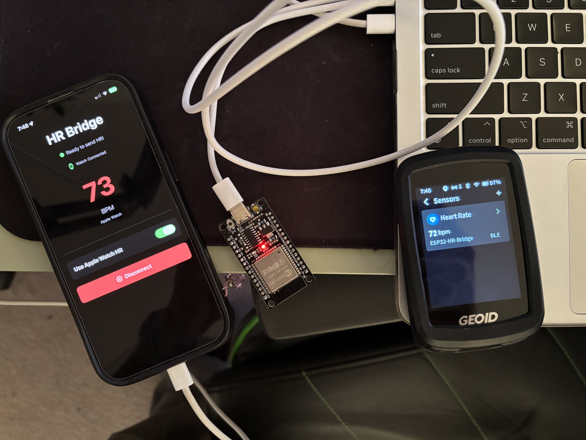

# HRBridge-ESP32

A bridge that relays Apple Watch heart rate data to BLE sport devices (cycling computers, trainers, etc.) using an ESP32 microcontroller.

## How it works

1. **Apple Watch** - Reads real-time heart rate via HealthKit workout session
2. **iPhone App** - Receives HR data from Watch via WatchConnectivity
3. **ESP32** - Receives HR from iPhone via custom BLE service
4. **Your device** - Connects to ESP32 as a standard BLE heart rate sensor

The ESP32 acts as a dual role BLE device: it's a peripheral (server) for both the iPhone and your bike computer/trainer, broadcasting standard Heart Rate Service (UUID `180D`) that any BLE-compatible sport device can discover!

## Why not broadcast from the iPhone?

Some sport devices (like my Geoid CC700 Pro / Magene C606) don't directly support Apple Watch heart rate pairing. Apps like HeartCast require the iPhone to be the intermediary, but many cycling computers can't connect to both the iPhone *and* receive HR data simultaneously.

This solution solves that by using an ESP32 as a dedicated BLE heart rate broadcaster, allowing your sport device to stay connected to your iPhone!

## Requirements

For hardware, you'll require:

- **ESP32 development board** (any variant with BLE support)
- **USB cable** for ESP32 power
- **iPhone** with Bluetooth
- **Apple Watch** (watchOS 9+)

And you have to compile it yourself, so, you'll need a Mac.

## 📸 Showcase

